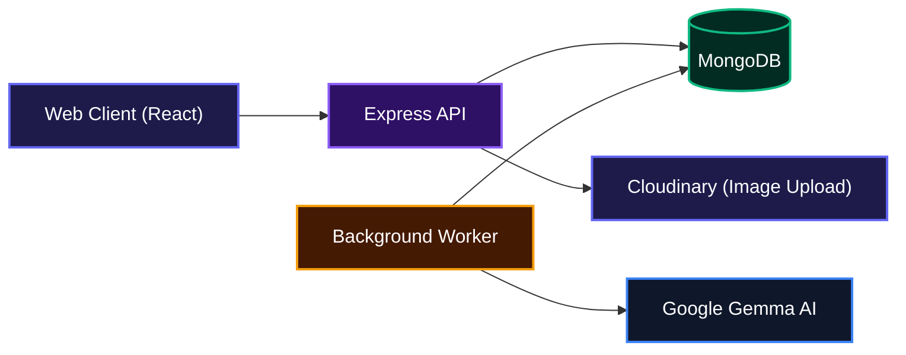
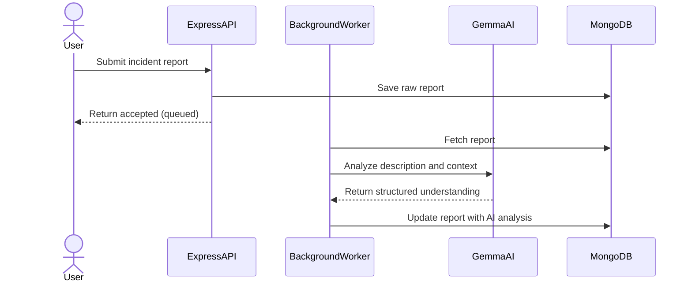
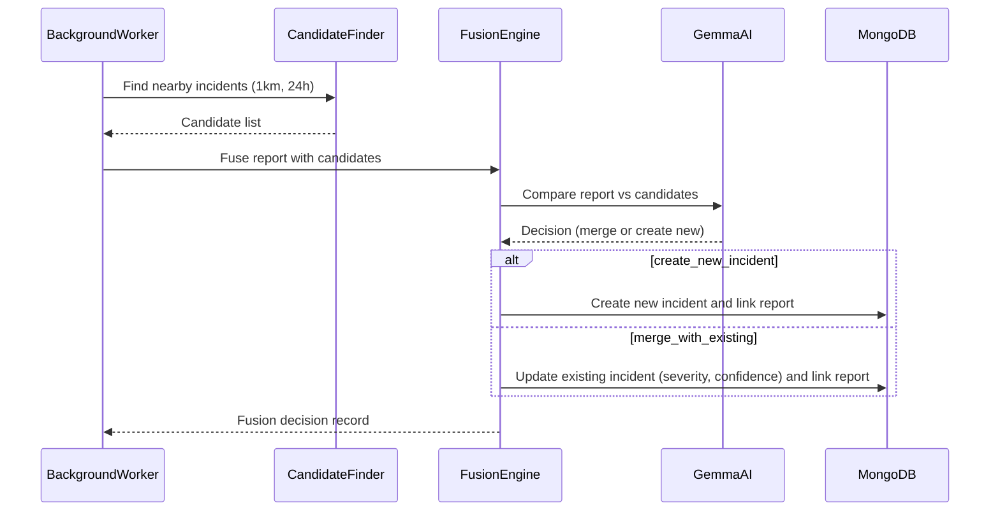

# CivicLens - AI-Powered Incident Intelligence System

Turn raw citizen reports into real-time incident intelligence using AI - no manual sorting, no duplicate entries, just clear, actionable insights the moment you need them.

## Overview

Emergency responders waste precious time piecing together reports about the same flood, road closure, or power outage when they come in from different sources. CivicLens fixes that by ingesting reports from citizens, officers, or social media, understanding what happened through AI, and automatically grouping related events by location. The result is a single source of truth that updates itself as new information arrives, giving decision-makers clarity in seconds.

## System Architecture



## Features

### AI-Powered Report Understanding
Every incoming report, whether it's a text description, an image URL, or a location, is sent to Google's Gemma AI. The model extracts structured insights like category, severity, a human-readable summary, and recommended response actions. This information is stored directly on the report and fuels the rest of the pipeline.



### Geospatial Candidate Matching
After analysis, the system queries existing incidents within 1 km that were updated in the last 24 hours. MongoDB's geospatial indexes make this search nearly instant, ensuring we only compare reports that could actually be related. You'll never again wonder if that pothole report halfway across town is the same one.

### Intelligent Incident Fusion
A dedicated fusion engine uses Gemma to decide whether to create a brand new incident or merge with an existing one. When merging, it automatically adjusts confidence, upgrades severity if the new data suggests it, and preserves the best available summary. Every decision is recorded with reasoning and evidence, so you can trace the logic behind each merge.



### Automatic Briefing Generation
Every time an incident is created or updated, the system triggers a briefing generation. It gathers the incident summary and the most recent reports, sends them to Gemma, and produces a concise situational update. The briefing is available immediately via the API and can be surfaced in dashboards.

### Timeline Tracking
All changes to an incident are recorded in a timeline: creation, merges, severity changes, briefing updates. Each event captures the before/after state and the reason, giving you a full audit trail from the first report to the final resolution.

### Asynchronous Processing Queue
The API accepts reports instantly and queues them for background processing. An in-memory queue and a worker loop keep the pipeline running without blocking the client. The design is ready for a Redis-backed queue when you need to scale.

## Technologies Used

| Category            | Technology                                                                  |
| ------------------- | --------------------------------------------------------------------------- |
| Backend Runtime     | [Node.js](https://nodejs.org/)                                              |
| Backend Framework   | [Express](https://expressjs.com/)                                           |
| Database            | [MongoDB](https://www.mongodb.com/) with [Mongoose](https://mongoosejs.com/) |
| AI Service          | [Google Generative AI (Gemma)](https://ai.google.dev/)                      |
| Schema Validation   | [Zod](https://zod.dev/)                                                     |
| Image Hosting       | [Cloudinary](https://cloudinary.com/)                                       |
| Security            | [Helmet](https://helmetjs.github.io/), [CORS](https://github.com/expressjs/cors) |
| Frontend Framework  | [React](https://react.dev/)                                                 |
| Build Tool          | [Vite](https://vite.dev/)                                                   |
| Maps (frontend)     | [Leaflet](https://leafletjs.com/), [React Leaflet](https://react-leaflet.js.org/) |
| Styling             | [Tailwind CSS](https://tailwindcss.com/)                                    |

## Installation

1. Clone the repository

```bash
git clone git@github.com:Searcher06/AI-Powered-Incident-Intelligent-System.git
cd AI-Powered-Incident-Intelligent-System
```

2. Set up the backend

```bash
cd backend
pnpm install
```

Create a `.env` file inside the `backend` folder with the required variables:

```env
MONGO_URI=mongodb://127.0.0.1:27017/civiclens
GEMMA_API_KEY=your_google_ai_api_key
PORT=5000
```

**Optional:** If you plan to use the image upload endpoint, add your Cloudinary credentials:

```env
CLOUDINARY_CLOUD_NAME=...
CLOUDINARY_API_KEY=...
CLOUDINARY_API_SECRET=...
```

3. Set up the frontend (optional)

```bash
cd ../frontend
pnpm install
```

## Usage

Start the backend server and the background worker:

```bash
cd backend
pnpm run dev
```

The API will be available at `http://localhost:5000`. The background worker starts automatically with the server and processes any queued reports.

To quickly test the full pipeline, post the included demo reports while the backend is running:

```bash
pnpm run demo:post
```

This sends five sample reports (three flood-related, two power-outage related) to `POST /reports` and triggers the entire intelligence pipeline. After a few seconds, you can inspect the database to see the fused incidents, briefings, and fusion decisions.

The frontend development server can be started separately:

```bash
cd frontend
pnpm dev
```

**Note:** The React frontend is currently a boilerplate and not yet connected to the backend. The UI for viewing incidents and dashboards is under active development.

## API Documentation

### POST /reports

**Description**: Submit a new incident report. The report is saved immediately and queued for background analysis.

**Request**:

```json
{
  "sourceType": "whatsapp",
  "reporterType": "citizen",
  "description": "Flooding on Main St near the bridge, water rising fast.",
  "language": "en",
  "timestamp": "2026-07-29T08:00:00Z",
  "location": {
    "text": "Main St Bridge",
    "coordinates": {
      "type": "Point",
      "coordinates": [-122.4194, 37.7749]
    }
  },
  "mediaAssets": [
    {
      "url": "https://example.com/image1.jpg",
      "mimeType": "image/jpeg"
    }
  ]
}
```

**Response** (201 Created):

```json
{
  "report": {
    "_id": "65c...",
    "sourceType": "whatsapp",
    "reporterType": "citizen",
    "description": "Flooding on Main St ...",
    "language": "en",
    "location": { ... },
    "timestamp": "2026-07-29T08:00:00.000Z",
    "mediaAssets": [ ... ],
    "status": "submitted"
  },
  "message": "Report accepted and queued for analysis"
}
```

**Errors**:
- 500: Internal server error if the report could not be saved or the queue fails.

---

### GET /reports

**Description**: List all reports, with optional filters.

**Query Parameters**:

| Parameter  | Type   | Description |
|------------|--------|-------------|
| `status`   | string | Filter by report status (`submitted`, `analyzing`, `matching`, `merged`, `completed`, `rejected`) |
| `incidentId` | string | Filter by linked incident ID |
| `limit`    | number | Page size (default 20, max 100) |
| `page`     | number | Page number (default 1) |

**Response**:

```json
{
  "reports": [ ... ],
  "pagination": {
    "total": 42,
    "page": 1,
    "pageSize": 20,
    "totalPages": 3
  }
}
```

---

### GET /reports/:id

**Description**: Retrieve a single report by its ID.

**Response**:

```json
{
  "report": { ... }
}
```

**Errors**:
- 400: Invalid report ID format.
- 404: Report not found.

---

### GET /incidents

**Description**: List incidents with optional filters.

**Query Parameters**:

| Parameter  | Type   | Description |
|------------|--------|-------------|
| `status`   | string | `active`, `critical`, `resolved`, `archived` |
| `severity` | string | `low`, `medium`, `high`, `critical` |
| `category` | string | Case-insensitive regex search (e.g. `flood`) |
| `limit`    | number | Page size (default 20, max 100) |
| `page`     | number | Page number (default 1) |

**Response**:

```json
{
  "incidents": [ ... ],
  "pagination": {
    "total": 15,
    "page": 1,
    "pageSize": 20,
    "totalPages": 1
  }
}
```

---

### GET /incidents/stats

**Description**: Return dashboard-level statistics.

**Response**:

```json
{
  "totalIncidents": 15,
  "activeIncidents": 8,
  "criticalIncidents": 2,
  "resolvedIncidents": 5,
  "totalReports": 120,
  "categoryBreakdown": [
    { "_id": "flooding", "count": 7 },
    { "_id": "power_outage", "count": 5 },
    { "_id": "road_blockage", "count": 3 }
  ]
}
```

---

### GET /incidents/:id

**Description**: Get full incident details, including the latest briefing.

**Response**:

```json
{
  "_id": "...",
  "title": "Main St Bridge Flooding",
  "category": "flooding",
  "severity": "high",
  "confidence": 0.92,
  "status": "active",
  "summary": "Water is rising near the Main St bridge causing road closures.",
  "recommendedResponse": "Dispatch sandbags and close the affected bridge until water recedes.",
  "reportCount": 3,
  "latestBriefingId": { ... },
  "location": { ... }
}
```

**Errors**:
- 400: Invalid incident ID.
- 404: Incident not found.

---

### GET /incidents/:id/reports

**Description**: List all reports linked to a specific incident.

**Query Parameters**: `limit`, `page` (same as above).

**Response**:

```json
{
  "reports": [ ... ],
  "pagination": { ... }
}
```

---

### GET /incidents/:id/timeline

**Description**: Retrieve the full timeline of events for an incident.

**Response**:

```json
{
  "events": [
    {
      "_id": "...",
      "incidentId": "...",
      "eventType": "created",
      "triggeredBy": "fusion",
      "before": {},
      "after": { "incidentId": "...", "severity": "medium" },
      "reason": "New incident created from first report"
    }
  ]
}
```

---

### GET /incidents/:id/briefing

**Description**: Get the latest operational briefing for an incident.

**Response**:

```json
{
  "briefing": {
    "_id": "...",
    "incidentId": "...",
    "text": "Flooding continues at Main St bridge with water levels still rising. Recommend road closure and diversion of traffic to alternate routes. Two additional reports confirm the situation is active.",
    "confidence": 0.91,
    "basedOnReportIds": ["...", "...", "..."],
    "generatedAt": "2026-07-29T08:25:00.000Z"
  }
}
```

**Errors**:
- 404: No briefing available yet.

---

### PATCH /incidents/:id/status

**Description**: Manually update the status of an incident (e.g., mark as resolved). This action is recorded in the timeline.

**Request**:

```json
{
  "status": "resolved"
}
```

**Response**:

```json
{
  "incident": { ... }
}
```

**Errors**:
- 400: Invalid status value (allowed: `active`, `critical`, `resolved`, `archived`).
- 404: Incident not found.

---

### POST /upload

**Description**: Upload an image file to Cloudinary. Returns a URL that can be included in the `mediaAssets` array when submitting a report.

**Request**: multipart/form-data with field name `image`.

Accepted MIME types: `image/jpeg`, `image/jpg`, `image/png`, `image/webp`, `image/gif`. Maximum file size: 10 MB.

**Response** (201 Created):

```json
{
  "url": "https://res.cloudinary.com/.../civiclens/reports/...",
  "publicId": "civiclens/reports/...",
  "mimeType": "image/jpeg",
  "message": "Image uploaded successfully"
}
```

**Errors**:
- 400: No file provided or unsupported file type.
- 503: Cloudinary permissions missing (API key lacks upload permission).

---

### GET /health

**Description**: Health check endpoint.

**Response**:

```json
{
  "status": "ok",
  "service": "civiclens-backend"
}
```

## Environment Variables

| Variable         | Description                                    | Default |
|------------------|------------------------------------------------|---------|
| `MONGO_URI`      | MongoDB connection string                      | `mongodb://127.0.0.1:27017/civiclens` |
| `GEMMA_API_KEY`  | Google Generative AI API key                   | *required* |
| `PORT`           | Server port                                    | `5000` |
| `CLOUDINARY_CLOUD_NAME` | Cloudinary cloud name (optional)       | - |
| `CLOUDINARY_API_KEY`    | Cloudinary API key                       | - |
| `CLOUDINARY_API_SECRET` | Cloudinary API secret                    | - |
| `GEMMA_MODEL_VERSION`   | Override the Gemma model version (default `gemma-4`) | `gemma-4` |

## Contributing

Contributions are welcome. Please open an issue to discuss your idea before submitting a pull request.

## Author

- X (Twitter): [https://x.com/undefined_dev](https://x.com/undefined_dev)

---

[](https://react.dev/)
[](https://vite.dev/)
[](https://tailwindcss.com/)
[](https://expressjs.com/)
[](https://www.mongodb.com/)
[](https://ai.google.dev/)

[](https://dokugen.samueltuoyo.com)