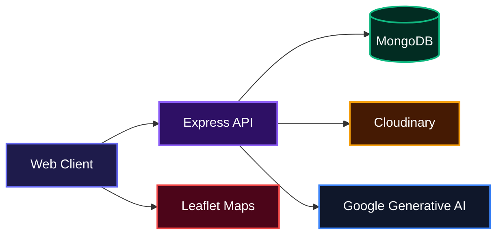
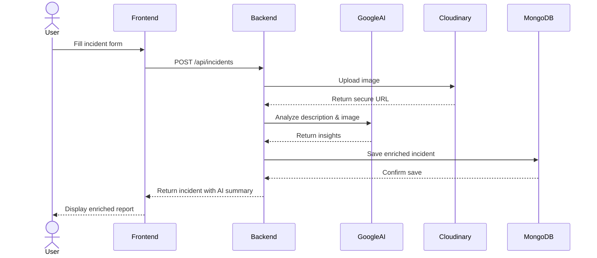

# AI-Powered Incident Intelligent System

A modern, full-stack application that transforms how teams capture, analyze, and resolve incidents. By combining an intelligent frontend with a powerful backend and Google’s Generative AI, the system automatically extracts insights from reports, handles media uploads with Cloudinary, and provides location-aware dashboards using Leaflet maps.

## Overview

Traditional incident reporting is chaotic. Teams waste hours digging through scattered information while critical details get missed. This project changes that. It gives you a single, intuitive interface where anyone can submit an incident with images, descriptions, and location data. Behind the scenes, Google’s Generative AI analyzes every report, highlights key patterns, and suggests next steps. All media is securely stored via Cloudinary, and a live map shows exactly where incidents are happening. No more guessing. Just clarity.

## System Architecture



## Features

### Incident Reporting with AI Enrichment
Submit detailed incident reports including text descriptions, photos, and geolocation. The system automatically sends each report through Google’s Generative AI to extract key entities, classify severity, and summarize the event, so you instantly understand what happened and what to do next.



### Real‑time Incident Map
All reported incidents appear on an interactive Leaflet map powered by coordinates captured during submission. Filter and click through pins to see full details without leaving the map.

### Secure Media Handling with Cloudinary
Any uploaded images or attachments are securely processed and stored by Cloudinary, with automatic optimization and transformation for fast, responsive delivery across all devices.

### Form Validation with Zod & React Hook Form
Frontend forms are built with `react‑hook‑form` and validated using Zod schemas, providing a smooth user experience with real‑time error feedback and no unnecessary re‑renders.

### API Security & Rate Limiting
The Express backend uses Helmet to set HTTP security headers, CORS to control cross‑origin requests, and Morgan for logging request activity. Future updates will include rate limiting to protect the API from abuse.

## Technologies Used

| Category            | Technology                                                      |
| ------------------- | --------------------------------------------------------------- |
| Frontend Framework  | [React](https://react.dev/)                                     |
| Build Tool          | [Vite](https://vite.dev/)                                       |
| Styling             | [Tailwind CSS](https://tailwindcss.com/)                        |
| Forms & Validation  | [React Hook Form](https://react-hook-form.com/), [Zod](https://zod.dev/) |
| Maps                | [Leaflet](https://leafletjs.com/), [React Leaflet](https://react-leaflet.js.org/) |
| Routing             | [React Router](https://reactrouter.com/)                        |
| HTTP Client         | [Axios](https://axios-http.com/)                                |
| Icons               | [Lucide React](https://lucide.dev/)                             |
| Backend Runtime     | [Node.js](https://nodejs.org/)                                  |
| Backend Framework   | [Express](https://expressjs.com/)                               |
| Database            | [MongoDB](https://www.mongodb.com/) with [Mongoose](https://mongoosejs.com/) |
| AI Service          | [Google Generative AI](https://ai.google.dev/)                  |
| Media Storage       | [Cloudinary](https://cloudinary.com/)                           |
| API Validation      | [Zod](https://zod.dev/)                                         |
| File Upload         | [Multer](https://github.com/expressjs/multer)                   |
| Security            | [Helmet](https://helmetjs.github.io/), [CORS](https://github.com/expressjs/cors) |

## Installation

1. Clone the repository

```bash
git clone git@github.com:Searcher06/AI-Powered-Incident-Intelligent-System.git
cd AI-Powered-Incident-Intelligent-System
```

2. Set up the backend

```bash
cd backend
pnpm install
```

Create a `.env` file inside the `backend` folder with the following variables:

```env
MONGODB_URI=mongodb://localhost:27017/incidents
GOOGLE_AI_API_KEY=your_google_ai_api_key
CLOUDINARY_CLOUD_NAME=your_cloud_name
CLOUDINARY_API_KEY=your_api_key
CLOUDINARY_API_SECRET=your_api_secret
PORT=5000
```

3. Set up the frontend

```bash
cd ../frontend
pnpm install
```

## Usage

Start the backend server (once the API routes are implemented, a npm start script will be available). For now, you can run a development server placeholder.

```bash
cd backend
node index.js
```

In a separate terminal, run the frontend development server:

```bash
cd frontend
pnpm dev
```

The application will be available at `http://localhost:5173`.

## API Documentation

The backend REST API is being built to support the following resources. All endpoints are prefixed with `/api/v1`.

### Incidents
| Method | Endpoint               | Description                    |
| ------ | -----------------------| ------------------------------ |
| POST   | `/incidents`           | Create a new incident          |
| GET    | `/incidents`           | List all incidents (with filters) |
| GET    | `/incidents/:id`       | Get a single incident          |
| PATCH  | `/incidents/:id`       | Update incident details        |
| DELETE | `/incidents/:id`       | Delete an incident             |
| POST   | `/incidents/:id/analyze` | Trigger AI analysis            |

**Authentication**: Token‑based authentication will be added in upcoming releases.

**Request/Response schemas** are validated with Zod. Full API documentation will be published once the routes are complete.

## Contributing

Contributions are welcome. Please open an issue to discuss your idea before submitting a pull request.

## Author

X (Twitter): [https://x.com/undefined_dev](https://x.com/undefined_dev)

---

[](https://react.dev/)
[](https://vite.dev/)
[](https://tailwindcss.com/)
[](https://expressjs.com/)
[](https://www.mongodb.com/)
[](https://ai.google.dev/)
[](https://cloudinary.com/)

[](https://dokugen.samueltuoyo.com)