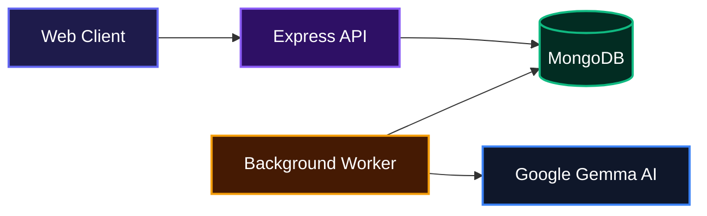
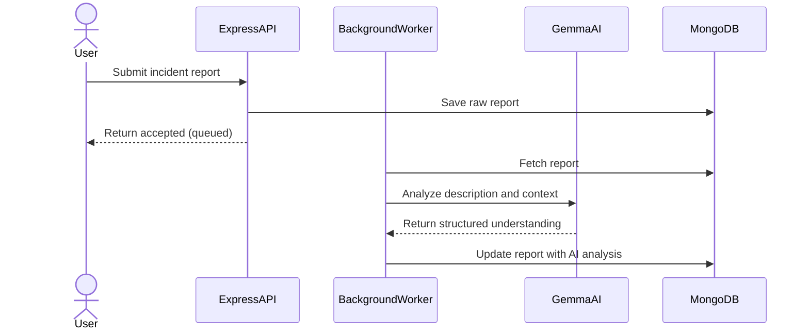
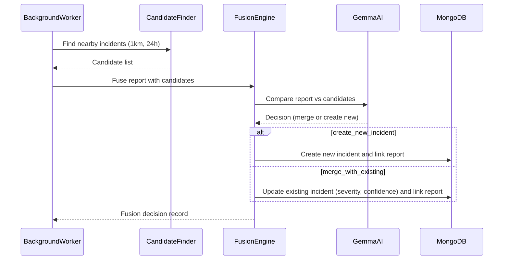

# CivicLens - AI-Powered Incident Intelligence System

A modern backend pipeline that transforms raw incident reports into actionable intelligence using Google's Gemma AI. It automatically analyzes incoming reports, finds related incidents across your city, fuses information into unified records, and generates concise briefings, all without human intervention.

## Overview

When multiple reports about the same flood, road closure, or emergency flood in from different sources, emergency responders waste precious time piecing them together manually. This system fixes that. It ingests reports from citizens, officers, or social media, then uses AI to understand what actually happened, group related events by location, and keep a live timeline of every incident. The result: a single source of truth that updates itself as new information arrives, giving decision-makers clarity in seconds.

## System Architecture



## Features

### AI-Powered Report Understanding
Every incoming report, whether it's a text description, an image URL, or a location, is sent to Gemma. The model extracts key details like category, severity, a readable summary, and recommended response actions. This structured understanding is stored directly on the report, ready for downstream processing.



### Geospatial Candidate Matching
When a new report arrives, the system queries existing incidents within 1km that were updated in the last 24 hours. This spatial search uses MongoDB's geospatial indexes, ensuring we only compare reports that could actually be related. No more guessing whether that pothole report is the same one across town.

### Intelligent Incident Fusion
A dedicated fusion engine compares the new report against the candidates found earlier. Using Gemma, it decides whether to create a brand new incident or merge with an existing one. If merging, it automatically adjusts the incident's confidence, upgrades severity if the new data suggests it, and preserves the best available summary. Every decision is recorded with reasoning and evidence.



### Automatic Briefing Generation
Every time an incident is created or updated, the system can trigger a briefing generation. It gathers the incident summary and the most recent reports, sends them to Gemma, and produces a concise situational update. This briefing is stored on the incident and can be surfaced in dashboards or pushed to stakeholders.

### Timeline Tracking
All changes to an incident are recorded in a timeline, including creation, merges, severity changes, and briefing updates. Each event captures the before/after state and the reason, giving you a full audit trail.

### Asynchronous Processing Queue
The API accepts reports and immediately queues them for background processing. A simple in-memory queue and worker keep the pipeline running without blocking the client. This design can later be swapped for a Redis-backed queue for scale.

## Technologies Used

| Category            | Technology                                                                  |
| ------------------- | --------------------------------------------------------------------------- |
| Backend Runtime     | [Node.js](https://nodejs.org/)                                              |
| Backend Framework   | [Express](https://expressjs.com/)                                           |
| Database            | [MongoDB](https://www.mongodb.com/) with [Mongoose](https://mongoosejs.com/) |
| AI Service          | [Google Generative AI (Gemma)](https://ai.google.dev/)                      |
| Schema Validation   | [Zod](https://zod.dev/)                                                     |
| Security            | [Helmet](https://helmetjs.github.io/), [CORS](https://github.com/expressjs/cors) |
| Frontend Framework  | [React](https://react.dev/) (planned UI)                                   |
| Build Tool          | [Vite](https://vite.dev/)                                                   |
| Maps (frontend)     | [Leaflet](https://leafletjs.com/), [React Leaflet](https://react-leaflet.js.org/) |
| Styling             | [Tailwind CSS](https://tailwindcss.com/)                                    |

## Installation

1. Clone the repository

```bash
git clone git@github.com:Searcher06/AI-Powered-Incident-Intelligent-System.git
cd AI-Powered-Incident-Intelligent-System
```

2. Set up the backend

```bash
cd backend
pnpm install
```

Create a `.env` file inside the `backend` folder with:

```env
MONGO_URI=mongodb://127.0.0.1:27017/civiclens
GEMMA_API_KEY=your_google_ai_api_key
PORT=5000
```

3. Set up the frontend (optional UI)

```bash
cd ../frontend
pnpm install
```

## Usage

Start the backend server:

```bash
cd backend
pnpm run dev
```

The API will be available at `http://localhost:5000`. The background worker starts automatically with the server, processing any queued reports.

To quickly test the pipeline, post the included demo reports while the backend is running:

```bash
pnpm run demo:post
```

This sends three sample flood reports to `POST /reports` and triggers the full intelligence pipeline. Afterwards, you can inspect the database to see the created incident, briefing, and fusion decisions.

If you want to start the server without a database connection (for smoke testing):

```bash
SKIP_DB=true node src/server.js
```

The frontend development server can be started separately:

```bash
cd frontend
pnpm dev
```

Note: The React frontend is currently a boilerplate and not yet connected to the backend. The UI for viewing incidents and dashboards is under development.

## API Documentation

### POST /reports

**Description**: Submit a new incident report for analysis and intelligence processing. The report is saved immediately and queued for background analysis. The response returns the saved report with a `submitted` status.

**Request**:

```json
{
  "sourceType": "whatsapp",
  "reporterType": "citizen",
  "description": "Flooding on Main St near the bridge, water rising fast.",
  "language": "en",
  "timestamp": "2026-07-29T08:00:00Z",
  "location": {
    "text": "Main St Bridge",
    "coordinates": {
      "type": "Point",
      "coordinates": [-122.4194, 37.7749]
    }
  },
  "mediaAssets": [
    {
      "url": "https://example.com/image1.jpg",
      "mimeType": "image/jpeg"
    }
  ]
}
```

**Response** (201 Created):

```json
{
  "report": {
    "_id": "65c...",
    "sourceType": "whatsapp",
    "reporterType": "citizen",
    "description": "Flooding on Main St ...",
    "language": "en",
    "location": { ... },
    "timestamp": "2026-07-29T08:00:00.000Z",
    "mediaAssets": [ ... ],
    "status": "submitted",
    ...
  },
  "message": "Report accepted and queued for analysis"
}
```

**Errors**:
- 500: Internal server error if the report could not be saved or the queue fails.

**Environment Variables**:

| Variable          | Description                                    | Default                                |
| ----------------- | ---------------------------------------------- | -------------------------------------- |
| `MONGO_URI`       | MongoDB connection string                      | `mongodb://127.0.0.1:27017/civiclens` |
| `GEMMA_API_KEY`   | Google Generative AI API key                   | *required*                             |
| `PORT`            | Server port                                    | `5000`                                 |
| `SKIP_DB`         | Set to `true` to run without database          | `false`                                |
| `GEMMA_MODEL_VERSION` | Override the Gemma model version (default `gemma-4`) | `gemma-4` |

## Contributing

Contributions are welcome. Please open an issue to discuss your idea before submitting a pull request.

## Author

- X (Twitter): [https://x.com/undefined_dev](https://x.com/undefined_dev)

---

[](https://react.dev/)
[](https://vite.dev/)
[](https://tailwindcss.com/)
[](https://expressjs.com/)
[](https://www.mongodb.com/)
[](https://ai.google.dev/)

[](https://dokugen.samueltuoyo.com)