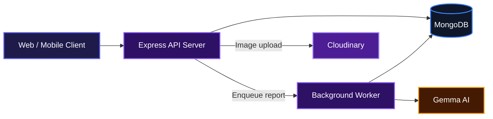
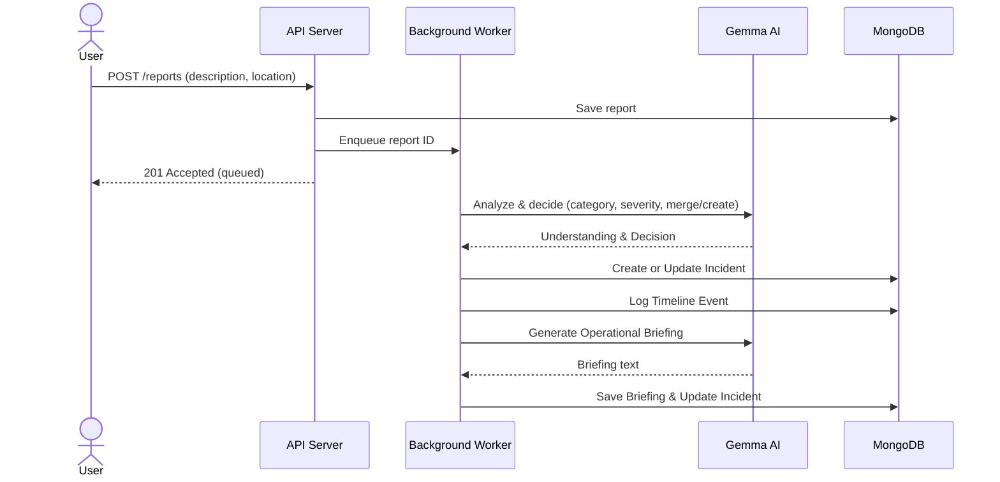

# CivicLens - AI-Powered Incident Intelligence System

A real-time engine that turns citizen reports from multiple channels into unified, actionable incidents for emergency response coordination.

## Overview

CivicLens processes incident reports from citizens, officers, and social media, then groups them intelligently so response teams aren't flooded with duplicates. It automatically tracks what's happening across a city, keeps a live activity feed, and generates plain-language operational briefings so coordinators know exactly where to focus.

## System Architecture



## Features

- **Multi-source report ingestion** — accepts reports via API from citizens, field officers, and social media (WhatsApp, Facebook, X, phone).
- **AI-powered report analysis** — extracts structured intelligence (category, severity, summary, tags, affected infrastructure) from raw descriptions.
- **Intelligent incident fusion** — decides whether a new report describes an existing incident (merge) or a brand-new one (create), all backed by an AI fusion engine.



- **Real-time activity feed and timeline** — a global feed of every event (incident creation, merges, severity changes, briefing updates) and per-incident timelines.
- **Automated briefing generation** — produces a concise operational briefing that a coordinator can act on immediately.
- **Severity escalation & status management** — automatically escalates incident severity when new evidence demands it, and supports manual status updates (active, critical, resolved, archived).
- **Image upload support** — accepts images from the field, stores them securely in Cloudinary, and links them to reports for richer analysis.

## Installation

1. **Clone the repository**

   ```bash
   git clone git@github.com:Searcher06/AI-Powered-Incident-Intelligent-System.git
   cd AI-Powered-Incident-Intelligent-System/backend
   ```

2. **Install dependencies**

   This project uses pnpm. Make sure you have it installed, then run:

   ```bash
   pnpm install
   ```

3. **Set up environment variables**

   Create a `.env` file in the `backend` directory with the following keys:

   ```env
   MONGODB_URI=mongodb://127.0.0.1:27017/civiclens
   GEMMA_API_KEY=your_google_genai_api_key
   CLOUDINARY_CLOUD_NAME=your_cloud_name
   CLOUDINARY_API_KEY=your_api_key
   CLOUDINARY_API_SECRET=your_api_secret
   PORT=5000
   GEMMA_MODEL_VERSION=gemma-4-31b-it  # optional, defaults to gemma-4-31b-it
   ```

4. **Start the server**

   ```bash
   pnpm run dev
   ```

   The API will be available at `http://localhost:5000`.

   To run without a MongoDB connection (smoke test mode), set `SKIP_DB=true`:

   ```bash
   SKIP_DB=true pnpm run dev
   ```

## Usage

Once the server is running, you can submit incident reports and query the results.

### Submit a demo dataset

A set of sample reports is included. With the server running and MongoDB available, post them with:

```bash
pnpm run demo:post
```

This will queue all sample reports for AI processing. You can then check the logs to see the worker picking them up and creating incidents.

### Example requests

**Post a new report**

```bash
curl -X POST http://localhost:5000/reports \
  -H "Content-Type: application/json" \
  -d '{
    "sourceType": "whatsapp",
    "reporterType": "citizen",
    "description": "Flooding on Main St near the bridge, water rising fast",
    "location": {
      "text": "Main St Bridge",
      "coordinates": { "type": "Point", "coordinates": [-122.4194, 37.7749] }
    },
    "timestamp": "2026-07-29T08:00:00Z"
  }'
```

Response:

```json
{
  "report": { "_id": "...", "status": "submitted", ... },
  "message": "Report accepted and queued for analysis"
}
```

**Get all incidents**

```bash
curl http://localhost:5000/incidents
```

**Get the global activity feed**

```bash
curl http://localhost:5000/feed
```

**Upload an image** (for attaching to a report later)

```bash
curl -X POST http://localhost:5000/upload \
  -F "image=@photo.jpg"
```

Returns a Cloudinary URL you can include in the `mediaAssets` array when posting a report.

**Get dashboard statistics**

```bash
curl http://localhost:5000/incidents/stats
```

## Technologies Used

| Technology        | Purpose                               |
|-------------------|---------------------------------------|
| Node.js           | JavaScript runtime                   |
| Express 5         | HTTP server framework                |
| MongoDB           | Primary database                     |
| Mongoose          | ODM for MongoDB                      |
| Google Gemma 4    | AI model for report analysis, fusion, and briefing |
| Cloudinary        | Image hosting                        |
| Multer            | Multipart file upload handling       |
| Helmet, CORS, Morgan | Security and request logging      |
| Zod               | Schema validation (for prompts)      |

## API Documentation

All endpoints are prefixed with the base URL (default `http://localhost:5000`).

### POST /reports
**Description**: Submit a new incident report. The report is saved immediately and queued for background AI processing.

**Request**
```json
{
  "sourceType": "whatsapp",
  "reporterType": "citizen",
  "description": "Flooding on Main St near the bridge",
  "language": "en",
  "location": {
    "text": "Main St Bridge",
    "coordinates": { "type": "Point", "coordinates": [-122.4194, 37.7749] }
  },
  "timestamp": "2026-07-29T08:00:00Z",
  "mediaAssets": []
}
```

**Response** (201 Created)
```json
{
  "report": {
    "_id": "67a1b2c3...",
    "sourceType": "whatsapp",
    "status": "submitted",
    ...
  },
  "message": "Report accepted and queued for analysis"
}
```

**Errors**
- 400: Invalid request body (e.g., missing required fields).
- 500: Server error.

### GET /reports
**Description**: List all reports with optional filters.

**Query Parameters**
- `status` — filter by status (submitted, analyzing, matching, merged, completed, rejected)
- `incidentId` — filter by linked incident ID
- `page` — page number (default 1)
- `limit` — results per page (default 20, max 100)

**Response**
```json
{
  "reports": [ ... ],
  "pagination": {
    "total": 42,
    "page": 1,
    "pageSize": 20,
    "totalPages": 3
  }
}
```

### GET /reports/:id
**Description**: Get a single report by its ID.

**Response**
```json
{
  "report": {
    "_id": "67a1b2c3...",
    "description": "...",
    "understanding": {
      "category": "flood",
      "severity": "high",
      "summary": "...",
      "confidence": 0.9,
      ...
    },
    ...
  }
}
```

**Errors**
- 400: Invalid report ID.
- 404: Report not found.

### POST /upload
**Description**: Upload an image file (multipart/form-data). The image is stored in Cloudinary and a URL is returned.

**Request**
`multipart/form-data` with field name `image`. Accepted MIME types: `image/jpeg`, `image/jpg`, `image/png`, `image/webp`, `image/gif`. Max file size: 10 MB.

**Response** (201 Created)
```json
{
  "url": "https://res.cloudinary.com/.../civiclens/reports/abc123.jpg",
  "publicId": "civiclens/reports/abc123",
  "mimeType": "image/jpeg",
  "message": "Image uploaded successfully"
}
```

**Errors**
- 400: No file provided or unsupported type.
- 503: Cloudinary permissions issue.

### GET /incidents
**Description**: List all incidents with optional filters.

**Query Parameters**
- `status` — active, critical, resolved, archived
- `severity` — low, medium, high, critical
- `category` — partial match (regex, case insensitive)
- `page`, `limit` — pagination

**Response**
```json
{
  "incidents": [ ... ],
  "pagination": {
    "total": 12,
    "page": 1,
    "pageSize": 20,
    "totalPages": 1
  }
}
```

### GET /incidents/stats
**Description**: Dashboard statistics (total incidents, active, critical, resolved, total reports, category breakdown).

**Response**
```json
{
  "totalIncidents": 12,
  "activeIncidents": 8,
  "criticalIncidents": 2,
  "resolvedIncidents": 2,
  "totalReports": 55,
  "categoryBreakdown": [
    { "_id": "flood", "count": 5 },
    { "_id": "power_outage", "count": 3 }
  ]
}
```

### GET /incidents/:id
**Description**: Full detail of a single incident, including the latest briefing (populated) and a live count of linked reports.

**Response**
```json
{
  "_id": "...",
  "title": "Main St Bridge Flooding",
  "category": "flood",
  "severity": "critical",
  "confidence": 0.92,
  "summary": "...",
  "reportCount": 3,
  ...
}
```

**Errors**
- 400: Invalid incident ID.
- 404: Not found.

### GET /incidents/:id/reports
**Description**: All reports linked to an incident, paginated.

**Response**
```json
{
  "reports": [ ... ],
  "pagination": {
    "total": 3,
    "page": 1,
    "pageSize": 50,
    "totalPages": 1
  }
}
```

### GET /incidents/:id/timeline
**Description**: Chronological list of timeline events (created, merged, severity_changed, briefing_updated, etc.).

**Response**
```json
{
  "events": [
    {
      "eventType": "created",
      "triggeredBy": "fusion",
      "reason": "...",
      "createdAt": "2026-07-29T08:30:00Z",
      ...
    },
    ...
  ]
}
```

### GET /incidents/:id/briefing
**Description**: Returns the latest operational briefing for an incident.

**Response**
```json
{
  "briefing": {
    "_id": "...",
    "text": "Flooding at Main St Bridge is worsening...",
    "confidence": 0.88,
    "basedOnReportIds": ["...", "..."],
    "generatedAt": "2026-07-29T08:35:00Z"
  }
}
```

**Errors**
- 404: No briefing available yet.

### PATCH /incidents/:id/status
**Description**: Manually update an incident's status. Allowed values: `active`, `critical`, `resolved`, `archived`. A timeline event is automatically logged.

**Request**
```json
{
  "status": "resolved"
}
```

**Response**
```json
{
  "incident": { ... }
}
```

**Errors**
- 400: Invalid status value or ID.
- 404: Incident not found.

### GET /feed
**Description**: Global activity feed of all timeline events across all incidents, newest first.

**Query Parameters**
- `page`, `limit` — pagination
- `eventType` — filter by type (created, merged, severity_changed, briefing_updated, status_changed, confidence_changed)
- `severity` — filter by parent incident severity

**Response**
```json
{
  "events": [
    {
      "_id": "...",
      "eventType": "merged",
      "incidentId": { "_id": "...", "title": "...", "category": "flood", ... },
      "reason": "...",
      "createdAt": "..."
    },
    ...
  ],
  "pagination": { ... }
}
```

### GET /feed/reports
**Description**: Raw reports feed, newest first, optionally filtered by status or severity (on the report's AI understanding).

**Query Parameters**
- `status`, `severity`, `page`, `limit`

**Response**
```json
{
  "reports": [ ... ],
  "pagination": { ... }
}
```

### Environment Variables

All required and optional environment variables for the backend:

| Variable                       | Description                                      | Required |
|--------------------------------|--------------------------------------------------|----------|
| `MONGODB_URI`                  | MongoDB connection string                        | Yes      |
| `GEMMA_API_KEY`                | Google GenAI API key for Gemma calls             | Yes      |
| `CLOUDINARY_CLOUD_NAME`        | Cloudinary cloud name                             | Yes (for uploads) |
| `CLOUDINARY_API_KEY`           | Cloudinary API key                                | Yes (for uploads) |
| `CLOUDINARY_API_SECRET`        | Cloudinary API secret                             | Yes (for uploads) |
| `PORT`                         | Server port (default: 5000)                      | No       |
| `SKIP_DB`                      | Set to "true" to start without MongoDB (testing) | No       |
| `GEMMA_MODEL_VERSION`          | Gemma model identifier (default: gemma-4-31b-it) | No       |

## Contributing

We welcome contributions. Please open an issue to discuss your ideas before submitting a pull request. Fork the repository, create a feature branch, and make sure your changes align with the project's style. No formal contribution guide yet.

## Author

- X (Twitter): [@undefined_dev](https://x.com/undefined_dev)

## Badges

[](https://nodejs.org/)
[](https://expressjs.com/)
[](https://www.mongodb.com/)
[](https://ai.google.dev/gemma)
[](https://cloudinary.com/)

[](https://dokugen.samueltuoyo.com)